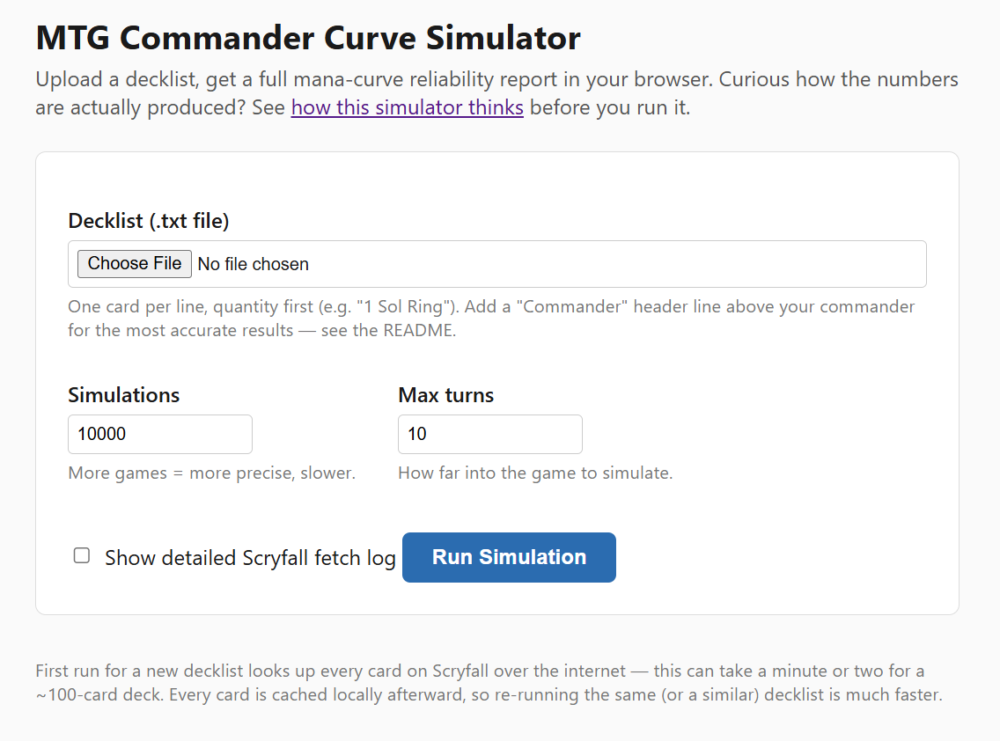
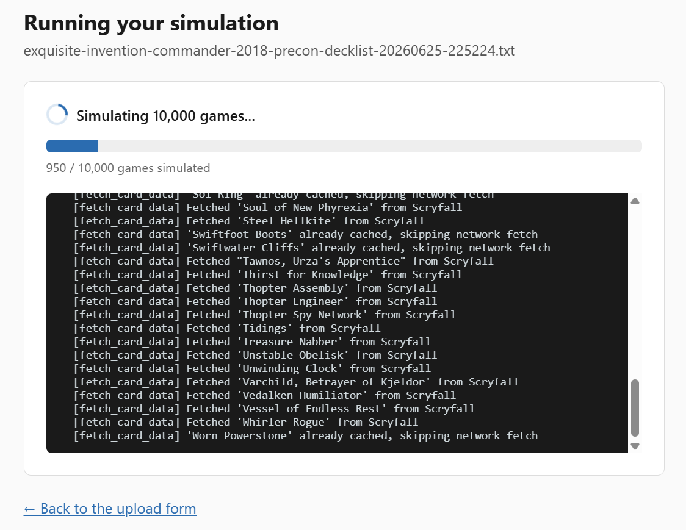
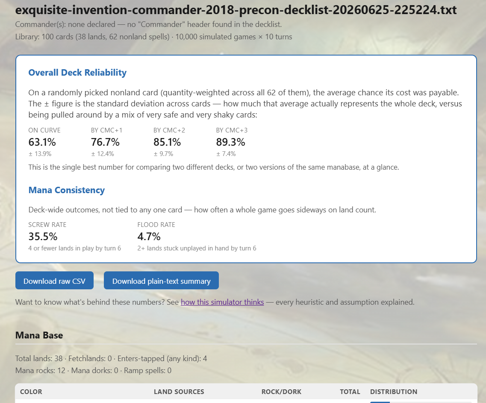

# MTG Commander Curve Simulator

A tool for Magic: The Gathering Commander (EDH) deckbuilders. You give it a
decklist; it plays out **10,000 simulated games** of your deck and tells you,
for every single nonland card, how reliably your mana base can actually pay
for it — turn by turn.

The easiest way to use it is the **local web app**: run one command, then do
everything else — uploading your decklist, setting options, and reading the
full report — in your browser. That's what this page focuses on. A
command-line mode also exists for anyone who prefers it; see
[Alternative: Command Line](#alternative-command-line) near the bottom.

This page assumes you've never used Python, a terminal, or GitHub before.
Every step is spelled out. If you're already comfortable with all of that,
skip to [Quick Start](#quick-start).

## Screenshots

<table>
<tr>
<td width="50%">

**Upload a decklist**


</td>
<td width="50%">

**Live progress while it runs**


</td>
</tr>
<tr>
<td colspan="2">

**Full results — reliability headline, mana consistency, and per-card curve table**


</td>
</tr>
</table>

## What does this actually tell me?

For every nonland card in your deck (creatures, spells, mana rocks — all of
it), you get a number like this:

```
 CMC   On-curve      cmc+1      cmc+2      cmc+3  Card
   3      61.2%      85.4%      92.6%      95.2%  Teferi, Time Raveler
```

Read this as: *"Across 10,000 simulated games, in 61.2% of them, this deck's
mana base could actually pay {1}{W}{U} by turn 3 (Teferi's own mana value).
By turn 6 (cmc+3), that climbs to 95.2%."*

**Important: this is not "how likely am I to draw this card."** It answers a
narrower, more useful question for deckbuilding: *if* this card is in your
hand, does your manabase actually support its colors and cost by the turn it
should come down? A card that scores low here isn't unlucky to draw — its
colors are undersupported relative to its cost, which is something you can
actually fix by changing the deck.

This lets you spot things like:

- **A weak color.** If every red card in your deck reliably lags behind your
  blue cards, your red sources are probably too thin.
- **An overcosted color intensity.** A double-pip card in your worst color is
  often the single hardest thing in the whole deck to cast on time — even if
  its mana value looks modest.
- **Whether your land count and fixing are actually enough**, instead of
  guessing from "the rule of thumb says 37 lands."

It does **not** replace playtesting, and it doesn't know about board states,
combat, or what your opponents are doing — see [What This Tool Doesn't Do](#what-this-tool-doesnt-do)
below. It also makes a specific, significant simplifying assumption about
card draw that's worth understanding before you trust the numbers — see the
next section.

**Before you rely on any of these numbers**, the web app has a full,
plain-language page explaining every heuristic and assumption behind them —
what each decision is, why it's made, and what it actually changes in your
results. You'll find a link to it right on the upload page and on every
results page once the app is running.

## Quick Start

```
pip install -r requirements.txt
python app.py
```

Then open `http://127.0.0.1:5000` in your web browser. Upload your decklist
`.txt` file, click **Run Simulation**, and read your results as a formatted
web page — no flags to remember, no terminal output to parse.

Everyone else, keep reading — the rest of this page walks through getting to
that point from scratch.

---

## Step 1 — Install Python

You need Python installed on your computer. If you're not sure whether you
already have it, open a terminal (see Step 3 below for how) and type:

```
python --version
```

If that prints something like `Python 3.11.4`, you're already set — skip to
Step 2.

If it says "command not found" or similar:

1. Go to **[python.org/downloads](https://www.python.org/downloads/)** and
   download the installer for your operating system.
2. Run the installer.
   - **Windows:** on the very first screen, check the box that says
     **"Add python.exe to PATH"** before clicking Install. This is the most
     commonly missed step — if you skip it, your computer won't know how to
     find Python from a terminal.
   - **Mac:** the installer handles this automatically.
3. Close and reopen any terminal windows, then check `python --version`
   again to confirm it worked. (On some systems the command is `python3`
   instead of `python` — if `python --version` doesn't work, try
   `python3 --version`.)

## Step 2 — Download this tool

If you're viewing this on GitHub:

1. Click the green **Code** button near the top of the repository page.
2. Click **Download ZIP**.
3. Once it's downloaded, extract/unzip it somewhere you'll remember (like
   your Desktop or Documents folder).

(If you're comfortable with Git, `git clone` works too, but the ZIP download
is simpler if you've never used Git.)

## Step 3 — Open a terminal in that folder

A "terminal" (also called a command prompt or shell) is just a window where
you type commands instead of clicking things. You'll use it to install the
one thing this tool depends on, and to start the web app.

- **Windows:** open the extracted folder in File Explorer, then hold
  **Shift** and **right-click** in an empty area inside the folder. Choose
  **"Open PowerShell window here"** (or **"Open in Terminal"** on Windows 11).
- **Mac:** open the extracted folder in Finder, right-click it, choose
  **Services > New Terminal at Folder**. (If that option isn't there, open
  the **Terminal** app from Applications > Utilities, type `cd ` — with a
  trailing space — then drag the folder into the Terminal window and press
  Enter.)
- **Linux:** most file managers have a "Open Terminal Here" option in the
  right-click menu.

You should now have a terminal window whose current location is the folder
containing `vibecodedCurveSim.py` and `app.py`.

## Step 4 — Install dependencies

This tool needs two additional pieces of software: `scrython` (to fetch card
data from [Scryfall](https://scryfall.com), a free public Magic card
database) and `flask` (a small local web server that runs the browser
interface). In the terminal you just opened, type:

```
pip install -r requirements.txt
```

and press Enter. You'll see some text scroll by as it downloads and
installs; when it's done, you're ready to go. (If `pip` isn't recognized,
try `pip3` instead, or `python -m pip install -r requirements.txt`.)

## Step 5 — Get your decklist as a plain text file

This is the part that trips people up most, so read carefully.

The tool needs a plain `.txt` file where **every line is a quantity followed
by a card name**, like this:

```
1 Sol Ring
1 Command Tower
38 Forest
1 Rampant Growth
```

**Where to get this file:** almost every deckbuilding website (Moxfield,
Archidekt, EDHREC, TappedOut, Commander Spellbook, etc.) has an "Export" or
"Copy to clipboard" option that gives you exactly this format, or something
very close to it. Copy that text into a new file, save it with a `.txt`
extension (e.g. `my_deck.txt`), and put it somewhere you'll remember — it
doesn't need to be in the tool's folder, since you'll upload it through the
browser.

A few things the tool handles automatically, so don't worry about cleaning
these up by hand:

- **Set codes and collector numbers** at the end of a line, like
  `1 Sol Ring (C21) 263`, are stripped automatically — export formats that
  include these are fine as-is.
- **Blank lines and comments** (lines starting with `#` or `//`) are
  ignored, so you can leave yourself notes.

**One thing you should do by hand — mark your Commander.** Most exports list
your commander as just another card in the list, which means the tool will
treat it like any other card you might or might not draw, instead of
something you can always cast from the command zone. To fix this, add a
`Commander` line above your commander (and, optionally, a `Deck` line above
the rest):

```
Commander
1 Atraxa, Praetors' Voice

Deck
1 Sol Ring
1 Command Tower
...
```

If your list has partner commanders or a background, put both under the
`Commander` heading. One side effect of doing this correctly: your commander
will then **disappear from the results table entirely** rather than getting
a row — that's expected, not a bug. It means the tool excluded it from the
simulated deck, exactly as intended, since it's cast from the command zone,
not drawn.

**If you skip this step, the tool will still run** —
it'll just treat your commander(s) as ordinary library cards instead of
cards you always have access to from the command zone. In practice this is a
fairly small effect (mostly: the library becomes 100 cards instead of 99,
and your commander occupies a hand slot in the simulation instead of being
free), but it's a real one, and free to avoid. Worth the extra 30 seconds.

## Step 6 — Run the web app

Start the web server from your terminal:

```
python app.py
```

You'll see some text in your terminal saying the server is running — leave
that window open (closing it stops the server). Open your web browser and go
to:

```
http://127.0.0.1:5000
```

You'll see a form: choose your decklist `.txt` file, optionally adjust the
number of simulations or turns, check the box for a detailed Scryfall
fetch log if you want one, and click **Run Simulation**.

Clicking that button takes you to a live progress page instead of a blank
tab — it shows which step is running (fetching cards, then simulating
games) and a games-simulated counter that fills in as the run progresses,
so you always know it's actually working rather than stuck. The first run
for a new decklist will take a little while — it's fetching every card from
Scryfall over the internet, one at a time, on purpose, to be polite to
Scryfall's servers — give it a minute or two on a ~100-card deck, and check
the fetch-log box if you want to watch it happen card by card. Every card it
looks up gets saved to a local file (`scryfall_cache.json`), so running the
*same* deck again — or a different deck that shares a lot of cards with one
you've already run — is much faster. Once the run finishes, the page moves
you to the results automatically.

To stop the server when you're done, go back to the terminal window it's
running in and press `Ctrl+C`.

**A note on scope:** this web page is meant for one person running it on
their own computer, not a public multi-user service — it keeps only the
most recent run in memory, so if you (or someone else) started a second run
on the same running server, it would replace the first one's results rather
than keeping them side by side. That's fine for personal use; it's not
designed to be deployed to the internet for multiple people to use at once.

## Step 7 — Reading your results

The results page opens with a headline **Overall Deck Reliability** number —
if you reached into your deck and pulled one nonland card out at random,
what's the average chance its cost was payable on curve? This is the single
most useful number for comparing two different decks, or two versions of the
same manabase before/after a change. Right beside it is a **±** figure — the
standard deviation across all your nonland cards. A small ± means every card
is about equally well-supported; a large ± means that average is misleading,
propped up by a handful of very safe cards while others are shakier than the
headline number suggests.

Just below the headline, a separate **Mana Consistency** box reports two
deck-wide, game-level rates that the per-card numbers can't show on their
own:

- **Screw rate** — how often a whole game has 4 or fewer lands in play by
  turn 6 (missed at least two of your first six land drops). High screw
  rates point to too few lands or too little early ramp.
- **Flood rate** — how often a whole game has 2 or more lands sitting
  unplayed in hand by turn 6. High flood rates point to too many lands
  relative to what you actually need to cast.

Below that:

- **Mana Base** — land count, fetch/tapped-land counts, and a per-color
  source count (lands and mana rocks/dorks counted separately), with bar
  charts.
- **Spell Curve Shape** — how many nonland cards sit at each mana value.
- **Color Reliability Index** — which of your colors is actually the
  weakest link, isolated from how many pips a card needs.
- **Notable Outliers** — your hardest-to-cast cards, your steepest
  "climbers" (cards that jump a lot from on-curve to one turn later), and
  your most reliable includes.
- **Deckbuilder Takeaways** — a handful of plain-language bullet points
  (land count adequacy, color balance, curve shape, land quality, chronic
  problem cards) written directly from the numbers above them.
- **The full per-card curve table**, sorted by mana value, with the same
  On-curve / cmc+1 / cmc+2 / cmc+3 columns shown in
  ["What does this actually tell me?"](#what-does-this-actually-tell-me).

A few patterns worth knowing how to read in that full table:

- **Colorless cards (artifacts, generic-cost spells) score very high, very
  early.** That's correct — they don't care about your color balance at all,
  only about having *any* land in play. Sol Ring is a good example.
- **Cards needing a rare color in your manabase score lower, and climb more
  slowly.** That's the tool doing its job — it's telling you that color is
  undersupported.
- **Double- or triple-pip costs in your weaker colors are usually the worst
  offenders.** If a card needs `{W}{W}` and white is your third color, it
  will often be the single hardest card in your deck to cast on time — worth
  knowing before you build around it.

Two buttons at the top let you download the same data as a raw CSV file (to
open in a spreadsheet program) or as a plain-text report (the same content
as the web page, formatted for pasting into a forum post or Discord). And at
the very bottom of every results page — as well as on the upload page before
you've run anything — there's a link to **how this simulator thinks**: a
full plain-language breakdown of every assumption and heuristic behind the
numbers, explained in a "what it decides / why / what it actually changes"
format. It's worth reading at least once, and especially before you draw a
strong conclusion from a single close percentage.

## Troubleshooting

**"scrython is required..." or "flask is required..."** — you skipped or
need to redo Step 4: `pip install -r requirements.txt`.

**"Could not find card 'X' on Scryfall"** — almost always a typo in your
decklist file, or a card name Scryfall doesn't recognize under that exact
spelling. Double-check the spelling (including punctuation like commas and
apostrophes) against Scryfall's website. The tool will skip that one card
and keep going rather than stopping the whole run — you'll see a warning
listing which cards were excluded.

**"Rate-limited by Scryfall; waiting 60s before retrying..."** — this is
normal and handled automatically, especially on a very large decklist or if
you're running several decks back-to-back. Just let it wait; it'll continue
on its own.

**It looks stuck / nothing is happening** — the web app's progress page
always shows a live status and, once simulation starts, a games-simulated
counter, so if that page is genuinely frozen (not just slow), try refreshing
it. On the *first* run of a new decklist, fetching every card from the
internet one at a time (on purpose, to be polite to Scryfall's servers) can
take up to a minute or two for a 100-card deck — that's normal, not stuck.
Check the box for the detailed fetch log on the upload form (or add
`--verbose` on the command line) to watch it working card by card.

**The progress page says "Lost connection to the server"** — the live
progress stream dropped, most often because the terminal running
`python app.py` was closed or the computer went to sleep mid-run. If the
terminal is still open, refreshing the progress page reconnects; if not,
restart `python app.py` and start the run again.

**My commander still shows up as a row in the results** — after adding the
`Commander` heading correctly (Step 5), your commander should disappear from
the output entirely, not show improved numbers — it's excluded from the
simulated deck altogether, since you already have guaranteed access to it
from the command zone. If it's still showing up as a row, double-check the
heading is spelled exactly `Commander`, on its own line, directly above your
commander's line.

**The page in my browser looks broken / says it can't connect** — make sure
the terminal window running `python app.py` is still open; closing it stops
the server. If you closed it, just run `python app.py` again and reload the
page.

## How the Simulated Player Makes Decisions

Every one of the 10,000 simulated games follows the exact same playstyle,
turn after turn. Understanding it helps you trust — and sanity-check — the
numbers, so here's the full picture of what the simulated player actually
does, in the order it does it.

### Building the opening hand (mulligans)

At the start of each game, the simulated player draws 7 cards and asks
itself one question: *"using only what's in this hand — no future draws —
could I cast at least two nonland cards within the first four turns?"* If
yes, it keeps the hand. If no, it mulligans: following the standard London
mulligan rule, it shuffles everything back in, draws a fresh 7, and will
need to set aside one card for each mulligan it's taken once it finally
keeps. It will try up to three times before being forced to keep whatever
it has.

When cards need to be set aside, it doesn't do so blindly: if the hand is
flooded with lands, it sets aside the extra lands first; otherwise, it sets
aside its most expensive cards, since those are the least likely to matter
in the immediate turns that decided whether the hand was worth keeping.

### Each turn, in order

1. **Draw a card.** Every turn, including turn 1 — this matches the actual
   tournament rule for multiplayer Commander specifically (the "skip your
   first draw" rule only applies to two-player games). It's always exactly
   one card, with no modeling for card-draw spells or effects — see
   [What This Tool Doesn't Do](#what-this-tool-doesnt-do) below for why that
   matters.

2. **Play one land.** This is the most consequential decision each turn, so
   it's worth walking through carefully. The simulated player looks at
   *everything* in hand that isn't castable yet with the mana currently
   available — creatures, instants, sorceries, mana rocks, mana dorks, ramp
   spells, all of it on equal footing — and identifies whichever one costs
   the least. Whatever color(s) that cheapest card needs, it tries to play a
   land that provides. If two or more different cards are tied for cheapest
   and need different colors, it looks for a land that covers as many of
   those needs as possible, preferring one that covers all of them if such a
   land exists in hand. Among lands that are equally good on color, it
   prefers ones that enter the battlefield untapped over ones that enter
   tapped; if a fetchland is available and nothing else distinguishes the
   choice, it treats cracking one as a small bonus, since it thins the deck
   for free. Fetchlands, and lands with entering-tapped conditions (Check
   Lands, Slow Lands, Fast Lands, and similar cycles), are resolved for
   real against the actual simulated library and battlefield state that
   game — not guessed at or approximated.

3. **Deploy one mana rock, mana dork, or ramp spell, if it can afford one —
   specifically, the *cheapest* one currently in hand that it can pay for.**
   This mirrors how these decks typically get sequenced in practice: a land
   plus one accelerant per turn. Mana rocks are usable the same turn they're
   played (matching the real rule that artifacts don't have summoning
   sickness); mana dorks come online starting the *following* turn (since
   creatures do have summoning sickness, unless the dork has Haste); a ramp
   spell's fetched land typically enters tapped, coming online the turn
   after that.

4. **Every other card in hand is left alone that turn** — no other spell
   actually gets cast. Instead, for every single nonland card in your whole
   decklist (whether or not it happens to be the one sitting in this
   particular hand this particular game), the tool checks whether that
   turn's mana could have paid for it, and records the result. This check is
   the actual measurement the entire tool is built around, and it's
   deliberately independent of the land-drop and accelerant decisions above
   — see ["What does this actually tell me?"](#what-does-this-actually-tell-me)
   near the top of this page for why that separation matters.

### What this playstyle is, and isn't

This is a consistent, mana-focused heuristic, not a strategic AI making
situational judgment calls. It doesn't hold back a removal spell for a
bigger threat, it doesn't bluff or play around anything, it has no idea what
your opponents are doing, and it will always play a land and deploy an
accelerant if it possibly can, every single turn. That's a deliberate
simplification, not an oversight: this tool exists to answer "does my mana
base support my costs," not "what's the objectively best play in this exact
moment." For that narrower, more useful question, always taking the
straightforward, mana-efficient line is the right assumption to build the
numbers on — a cleverer simulated player would introduce judgment calls that
have nothing to do with your manabase, muddying exactly the signal this tool
is trying to isolate.

## What This Tool Doesn't Do

This is a mana-base and curve calculator, not a full game simulator. Things
it deliberately does not model:

- **Card draw beyond one card per turn.** The simulated player never sees
  more than the plain one-per-turn baseline — card-draw spells, wheel
  effects, extra land drops, and similar card-advantage engines are not
  modeled at all. This is one of the most significant sources of pessimism
  in the tool: if your deck runs real card advantage, your actual games will
  find lands and key spells faster than these numbers suggest, because
  seeing more cards raises the odds of having the right one in hand by any
  given turn. Treat every percentage here as a *floor* for a deck with
  strong card draw, not a ceiling.
- **Life totals.** Fetch lands and shock lands are assumed to always pay
  their cost successfully — their life loss isn't tracked.
- **Opponents, combat, or board states.** It only knows about your deck's
  own cards and turn sequence.
- **Card abilities beyond "does this cost get paid."** It doesn't know what
  a spell *does* once cast, only whether the mana existed for it.
- **Every possible clever line of play.** It plays a reasonable, consistent
  strategy (one land and one mana rock/dork/ramp spell per turn, chasing
  whatever color your cheapest uncastable card needs) rather than searching
  for the objectively best possible play every turn.

None of these make the numbers wrong for what they're meant to answer — "can
my mana base support this card's cost" — but they're worth knowing about
before treating any single percentage as gospel. The web app has a full,
plain-language page walking through every one of these decisions in detail —
look for the **"how this simulator thinks"** link on the upload page or at
the bottom of any results page. The same information, in more technical
form, is documented at the top of `vibecodedCurveSim.py` itself, for anyone
curious enough to read the source.

## Alternative: Command Line

If you'd rather skip the browser entirely, the exact same simulation engine
is available as a command-line tool — same numbers, same assumptions, just
printed as a text table instead of a web page.

```
python vibecodedCurveSim.py my_deck.txt
```

(replacing `my_deck.txt` with whatever you named your file — if you saved it
somewhere else, use the full path instead, e.g.
`python vibecodedCurveSim.py "C:\Users\You\Desktop\my_deck.txt"`.)

This goes through the same Scryfall lookup and caching described in Step 6,
then plays out 10,000 simulated games and prints a table like the one shown
in ["What does this actually tell me?"](#what-does-this-actually-tell-me).

### Useful optional flags

Add these after the decklist filename, e.g.
`python vibecodedCurveSim.py my_deck.txt --csv results.csv`:

| Flag | What it does |
|---|---|
| `--csv results.csv` | Also save the raw results to a spreadsheet-friendly CSV file, so you can open it in Excel, Google Sheets, or Numbers. |
| `--summary report.txt` | Also save a deckbuilder-facing statistics summary — mana base breakdown, curve shape, a color reliability index, an overall reliability heuristic (with standard deviation and mana screw/flood rates) for comparing decks at a glance, and a plain-language takeaways section. This is the same content the web app's results page shows, as a plain-text file. |
| `--simulations 20000` | Run more simulated games (default 10,000) for a more precise answer, at the cost of taking longer to run. |
| `--max-turns 12` | Simulate further into the game (default 10 turns) — useful if your deck has a lot of very expensive cards. |
| `--verbose` | Print a line for every single card as it's looked up on Scryfall, so you can watch progress on a big decklist. |

Run `python vibecodedCurveSim.py --help` any time to see this list from the
tool itself.

## Contributing

Issues and pull requests are welcome. If you find a card or deck that
produces a result that looks wrong, please open an issue with the decklist
and the specific card/number you're questioning — that's exactly how most of
the bugs in this tool have been found so far.

## License

MIT — see [LICENSE](LICENSE). In short: free to use, modify, and redistribute,
including commercially, as long as the copyright notice stays attached.
